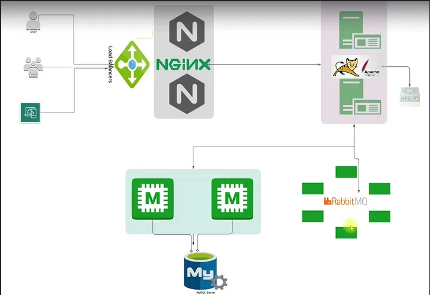
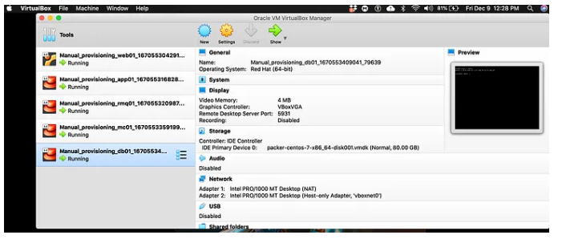
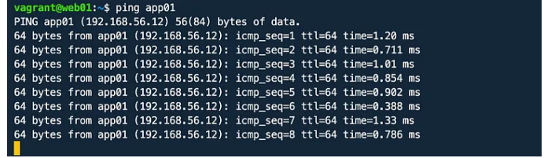

**Project-1: Vprofile Project: Multi Tier Web Application Stack Setup Locally**

Prerequisite
VPROFILE PROJECT SETUP

Oracle VM Virtualbox
Vagrant
Vagrant plugins
vagrant plugin install vagrant-hostmanager
vagrant plugin install vagrant-vbguest
Git bash or equivalent editor
Step1: VM Setup
clone the repository on gitbash
git clone [https://github.com/rumeysakdogan/vprofile-project.git](https://github.com/costas778/vprofile-project.git)
I went to the directory that has my Vagrantfile. I installed vagrant host manager with the command below before powering up my Virtual Box.
vagrant plugin install vagrant-hostmanager
After plugin installed, I ran the command below to powerup my VMs.
vagrant up
NOTE: Bringing VMs can take long time sometimes. If VM setup stops in the middle, run vagrant up command again.

We can check our VMs from Oracle VM VirtualBox Manager.

Next, I validated my VMs one by one with command vagrant ssh <name_of_VM_given_in_Vagrantfile>
vagrant ssh web01
I checked /etc/hosts file. Since plugin have have been installed, /etc/hosts file will be updated automatically.
cat /etc/hosts
Now I will try to ping app01 from web01 vbox.
ping app01

I was able to connect app01 successfully. I will check other services similarly.
logout
Lets connect to app01 vbox and check connectivity of app01 with rmq01, db01 and mc01.
cat /etc/hosts
ping rmq01
ping db01
ping mc01
logout
Step2: Provisioning
There are 6 different services for my application.
Services
1. Nginx:
Web Service
2. Tomcat
Application Server
3. RabbitMQ
Broker/Queuing Agent
4. Memcache
DB Caching
5. ElasticSearch
Indexing/Search service
6. MySQL
SQL Database

I need to setup my services in the order mentioned below.
1. MySQL (Database SVC)
2. Memcache (DB Caching SVC)
3. RabbitMQ  (Broker/Queue SVC)
4. Tomcat      (Application SVC)
5. Nginx (Web SVC)
Provisioning MySQL
vagrant ssh db01
Switch to root user and update all packages.
It is always a good practice to update OS with latest patches, when logged into the VM for the first time.
sudo su -
yum update -y
Set up db password using DATABASE_PASS environment variable and add it to /etc/profile file
DATABASE_PASS='admin123'
The above variable will be temporary, so, to make it permanent I need to add the variable above to/etc/profile file and update it.
vi /etc/profile
source /etc/profile
Next, I Installed the EPEL(Extra Packages for Enterprise Linux) repository.
You can look up EPEL here

yum install epel-release -y
Install Maria DB Package
yum install git mariadb-server -y
With Mariadb is installed, start and enable mariadb service. We can also check the status of mariadb service to make sure it is actively(running).

systemctl start mariadb
systemctl enable mariadb
systemctl status mariadb
RUN mysql secure installation script.
mysql_secure_installation
NOTE: For db root password, I usedadmin123
Set root password? [Y/n] Y
New password:
Re-enter new password:
Password updated successfully!
Reloading privilege tables..
... Success!
By default, a MariaDB installation has an anonymous user, allowing anyone
to log into MariaDB without having to have a user account created for
them.  This is intended only for testing, and to make the installation
go a bit smoother.  You should remove them before moving into a
production environment.
Remove anonymous users? [Y/n] Y
... Success!
Normally, root should only be allowed to connect from 'localhost'.  This
ensures that someone cannot guess at the root password from the network.
Disallow root login remotely? [Y/n] n
... skipping.
By default, MariaDB comes with a database named 'test' that anyone can
access.  This is also intended only for testing, and should be removed
before moving into a production environment.
Remove test database and access to it? [Y/n] Y
- Dropping test database...
... Success!
- Removing privileges on test database...
... Success!
Reloading the privilege tables will ensure that all changes made so far
will take effect immediately.
Reload privilege tables now? [Y/n] Y
... Success!
Check connectivity to db with command blow: Once it asks password, enter admin123 . If connection is succesful exit from DB.
mysql -u root -p
exit

Next, clone source code to db VM then change directory to src/main/resources/ to get the `sql queries.
git clone [https://github.com/rumeysakdogan/vprofile-project.git](https://github.com/costas778/vprofile-project.git)
cd vprofile-project/src/main/resources/

Run command below before initializing DB.
mysql -u root -p"$DATABASE_PASS" -e "create database accounts"
mysql -u root -p"$DATABASE_PASS" -e "grant all privileges on accounts.* TO 'admin'@'app01' identified by 'admin123' "
cd ../../..
mysql -u root -p"$DATABASE_PASS" accounts < src/main/resources/db_backup.sql
mysql -u root -p"$DATABASE_PASS" -e "FLUSH PRIVILEGES"
Login to database and do a quick verification to see if SQL queries start a databases with role ,user and user_role tables.
mysql -u root -p"$DATABASE_PASS"
MariaDB [(none)]> show databases;
MariaDB [(none)]> use accounts;
MariaDB [(none)]> show tables;
exit
Restart our mariadb server and logout.
systemctl restart mariadb
logout
Provisioning Memcache
Login to memcached server, and switch to root user.
vagrant ssh mc01
sudo su -
Similar to MySQL provisioning, start with updating OS with latest patches and download epel repository.
yum update -y
yum install epel-release -y
Install memcached package.
yum install memcached -y
Start/enable the memcached service and check the status of service.
systemctl start memcached
systemctl enable memcached
systemctl status memcache
Run command below to enablememcached listen on TCP port 11211 and UDP port 11111.
memcached -p 11211 -U 11111 -u memcached -d
Validate if port is running with command below:
ss -tunlp | grep 11211

All good, exit from server with exit command.
Provisioning RabbitMQ
Login to Rabbit MQ server and switch to root user.
vagrant ssh rmq01
sudo su -
Updating OS with latest patches and download epel repository.
yum update -y
yum install epel-release -y
Before installing RabbitMQ, we will install some dependencies first.
yum install wget -y
cd /tmp/
wget http://packages.erlang-solutions.com/erlang-solutions-2.0-1.noarch.rpm
sudo rpm -Uvh erlang-solutions-2.0-1.noarch.rpm
Now Install RabbitMQ server. With command below, install the script and pipe with shell to execute the script.
curl -s https://packagecloud.io/install/repositories/rabbitmq/rabbitmq-server/script.rpm.sh | sudo bash
sudo yum install rabbitmq-server -y
Lets start/enable the rabbitmq service and check the status of service.
systemctl start rabbitmq-server
systemctl enable rabbitmq-server
systemctl status rabbitmq-server
Create a test user with password test
create user_tag for test user as administrator.
If completed config changes, restartrabbitmq service
cd ~
echo "[{rabbit, [{loopback_users, []}]}]." > /etc/rabbitmq/rabbitmq.config
rabbitmqctl add_user test test
rabbitmqctl set_user_tags test administrator
systemctl restart rabbitmq-server
If your service active/running after restart, then we can move to the next service.

systemctl status rabbitmq-server
exit
Provisioning Tomcat
Login to app01 server first, and switch to root user.
vagrant ssh app01
sudo su -
Update OS with latest patches and download epel repository.
yum update -y
yum install epel-release -y
Install dependencies for Tomcat server.
yum install java-1.8.0-openjdk -y
yum install git maven wget -y
To download Tomcat, switch to /tmp/ directory.
cd /tmp
wget https://archive.apache.org/dist/tomcat/tomcat-8/v8.5.37/bin/apache-tomcat-8.5.37.tar.
tar xzvf apache-tomcat-8.5.37.tar.gz
Add tomcat user and copy data to tomcat home directory.
Check the new user tomcat with id tomcat command.
useradd --home-dir /usr/local/tomcat8 --shell /sbin/nologin tomcat
Copy your data to /usr/local/tomcat8 directory which is the home-directory for tomcat user.
cp -r /tmp/apache-tomcat-8.5.37/* /usr/local/tomcat8/
ls /usr/local/tomcat8
Currently root user has ownership of all files under /usr/local/tomcat8/ directory. change it to tomcat user.
ls -l /usr/local/tomcat8/
chown -R tomcat.tomcat /usr/local/tomcat8
ls -l /usr/local/tomcat8/
Setup systemd for tomcat, create a file with below content. After creating this file, start tomcat service with systemctl start tomcat and stop tomcat with systemctl stop tomcat commands.
Any changes made to file under /etc/systemd/system/ directory, we need to run below command to be effective:
[Unit] 
Description=Tomcat 
After=network.target
[Service]
User=tomcat
WorkingDirectory=/usr/local/tomcat8 
Environment=JRE_HOME=/usr/lib/jvm/jre 
Environment=JAVA_HOME=/usr/lib/jvm/jre 
Environment=CATALINA_HOME=/usr/local/tomcat8 
Environment=CATALINE_BASE=/usr/local/tomcat8 
ExecStart=/usr/local/tomcat8/bin/catalina.sh run 
ExecStop=/usr/local/tomcat8/bin/shutdown.sh 
SyslogIdentifier=tomcat-%i
[Install] 
WantedBy=multi-user.target
Enable tomcat service. The service name tomcat has to be same as given /etc/systemd/system/tomcat.service directory.
systemctl daemon-reload 
systemctl enable tomcat
systemctl start tomcat
systemctl status tomcat

Code Build & Deploy to Tomcat(app01) Server
In /tmp directory, we will clone our source code here.
git clone [https://github.com/rumeysakdogan/vprofile-project.git](https://github.com/costas778/vprofile-project.git)
ls
cd vprofile-project/
Before building your artifact, you need to update our configuration file that will be connect to our backend services db, memcached and rabbitmq service.
vi src/main/resources/application.properties
In application.properties file: make sure the settings are correct. First check DB configuration. Our db server is db01 , and we have admin user with password admin123 as we setup. For memcached service, hostname is mc01 and we validated it is listening on tcp port 11211. Fort rabbitMQ, hostname is rmq01 and we have created user test with pwd test.
#JDBC Configutation for Database Connection
jdbc.driverClassName=com.mysql.jdbc.Driver
jdbc.url=jdbc:mysql://db01:3306/accounts?useUnicode=true&characterEncoding=UTF-8&zeroDateTimeBehavior=convertToNull
jdbc.username=admin
jdbc.password=admin123
#Memcached Configuration For Active and StandBy Host
#For Active Host
memcached.active.host=mc01
memcached.active.port=11211
#For StandBy Host
memcached.standBy.host=127.0.0.2
memcached.standBy.port=11211
#RabbitMq Configuration
rabbitmq.address=rmq01
rabbitmq.port=5672
rabbitmq.username=test
rabbitmq.password=test
Run mvn install command to create our artifact. Artifact will be created in/tmp/vprofile-project/target/vprofile-v2.war

cd target/
ls
Deploy our artifact vprofile-v2.war to Tomcat server. But before that, remove default app from our server. For that reason first we will shutdown server. The default app will be in /usr/local/tomcat8/webapps/ROOT directory.
systemctl stop tomcat
systemctl status tomcat
rm -rf /usr/local/tomcat8/webapps/ROOT
Our artifact is under vprofile-project/target directory. Now we will copy our artifact to /usr/local/tomcat8/webapps/ directory as ROOT.war and start tomcat server. Once we start the server, it will extract our artifact ROOT.war under ROOT directory.
cd ..
cp target/vprofile-v2.war /usr/local/tomcat8/webapps/ROOT.war
systemctl start tomcat
ls /usr/local/tomcat8/webapps/
By the time, our application is coming up we can provision our Nginx server.
Provisioning Nginx
Nginx server is Ubuntu, despite our servers are RedHat. To update OS with latest patches run below command:
sudo apt update && sudo apt upgrade
Install nginx.
sudo su -
apt install nginx -y
Create a Nginx configuration file under directory /etc/nginx/sites-available/ with below content:
vi /etc/nginx/sites-available/vproapp
Content to add:
upstream vproapp {
server app01:8080;
}
server {
listen 80;
location / {
proxy_pass http://vproapp;
}
}
Remove default nginx config file:
rm -rf /etc/nginx/sites-enabled/default
Create a symbolic link for our configuration file using default config location as below to enable our site. Then restart nginx server.
ln -s /etc/nginx/sites-available/vproapp /etc/nginx/sites-enabled/vproapp
systemctl restart nginx
Validate Application from Browser
In web01 server, run ifconfig to get its IP address. So the IP address of our web01 is : 192.168.56.11
enp0s8: flags=4163<UP,BROADCAST,RUNNING,MULTICAST>  mtu 1500
        inet 192.168.56.11
First validate Nginx is running on browser http://<IP_of_Nginx_server>.

Validate Db connection using credentials admin_vp for both username and password.
Validate app is running from Tomcat server

Validate RabbitMQ connection by clicking RabbitMQ

Validate Memcache connection by clicking MemCache

Validate data is coming from Database when user first time requests it.

Validate data is coming from Memcached when user second time requests it.
CleanUp
In our manual provisioning directory carrying our vagrant file, run the command below to destroy all virtual machines.
vagrant destroy
